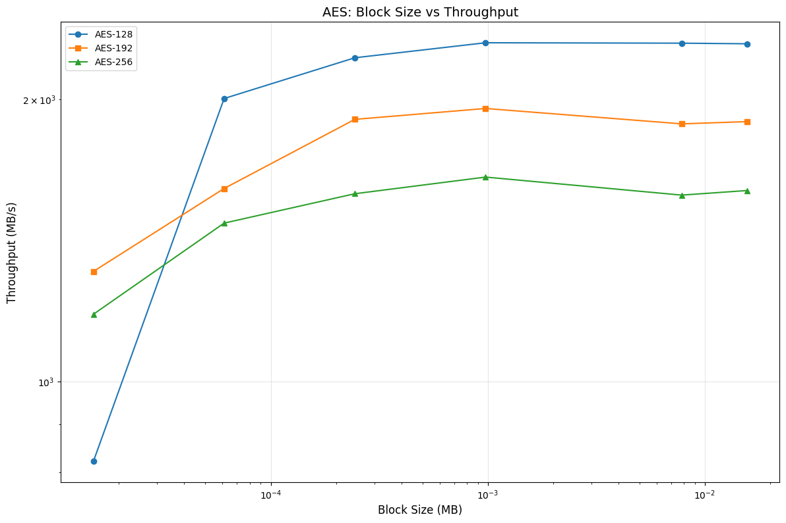
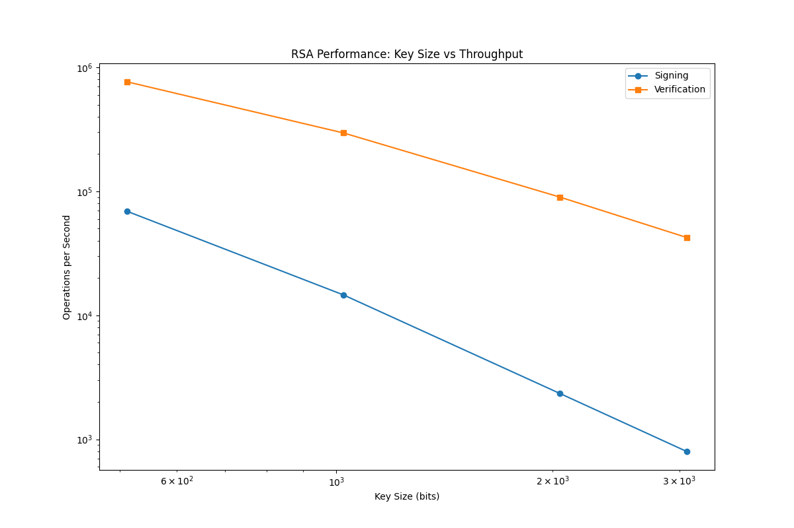

Questions: 
1. For task 1, looking at the resulting ciphertexts, what do you observe? Are you able to derive any useful information about either of the encrypted images? 
What are the causes for what you observe?

In ebc encryption we see a clear pattern still visible after encryption since the encryption only happens once, while in cbc encryption we split up the encryption per block changing what we are xoring the bytes with resulting in completely random ciphertext void of any patterns

2. For task 2, why this attack possible? What would this scheme need in order to prevent such attacks?

This attack is possible because CBC mode can be modified to have predictable changes when you alter it. If you flip a bit in ciphertext block N, then it flips the corresponding bit in plaintext block N+1 when decrypted. 

To prevent this, you would need to ensure an attacker doesn not know the structure of the plaintext or the padding that you use so they cannot modify the ciphertext to create a valid plaintext. Online, it also says you can use authenticated encryption like MAC or HMAC to ensure integrity. 

3. For task 3, how do the results compare? Make sure to include the plots in your 
report.

The results show that AES scales with data size, as throughput increases rapidly with larger block sizes, with AES-128 consistently outperforming AES-192 and AES-256 by a small margin. In comparison, RSA’s performance decreases as key size increases. Overall, this highlights why AES is used for high-throughput data encryption, while RSA is for small operations like key exchange.
